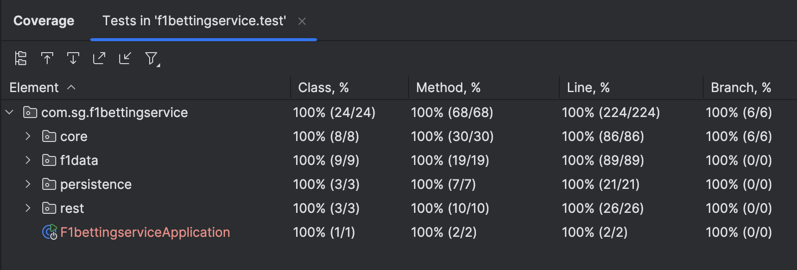

# F1 Betting Service

This project is a **backend service for Formula 1 betting**.  
It allows users to:
- Browse available F1 events (sessions).
- Place bets on drivers.
- Publish the outcome of an event and automatically settle bets (calculate winners, update user balances, etc.).

The data about F1 sessions and drivers comes from the public [OpenF1 API](https://openf1.org/).

---

## Architecture

The system is built following a **hexagonal approach**:
- **Core / Domain**: Business logic (`BetService`, `EventService`, `OutcomeService`, `UserService`).
- **Ports (interfaces)**: e.g. `F1DataProvider`, `UserRepository`, `BetRepository`, `OutcomeRepository`.
- **Adapters (implementations)**:
    - `OpenF1DataProvider` (calls OpenF1 API using `RestTemplate`).
    - In-memory repositories (`InMemoryUserRepository`, `InMemoryBetRepository`, `InMemoryOutcomeRepository`).
    - Rest controllers (`EventController`, `BetController`).
    - There is also one global API exception handler (`ApiExceptionHandler`) which handles functional exceptions and map them into HTTP response codes.

Key points:
- **OpenF1 API decoupled**: through the `F1DataProvider` interface and its adapter `OpenF1DataProvider`. If in the future the provider changes, the domain is not affected.
- **In-memory model**: For this exercise, data persistence is done in memory. Interfaces (`UserRepository`, `BetRepository` and `OutcomeRepository`.) are defined so a real database can be plugged in later.
- **Events are not stored**: By design, events are always fetched from OpenF1 (`/sessions`). Only bets, users, and outcomes are stored in the system with the references to the `event_id`.

---

## Endpoints

- `GET /api/v1/events` → List F1 events (sessions) with its drivers and odds.
- `POST /api/v1/events/outcome` → Publish the outcome of an event, settle bets, update balances and store outcome.
- `POST /api/v1/bets/place` → Place a bet.

---

## Test Coverage

The project has **100% test coverage**. 

## Development Approach: Test-Driven Development (TDD)

This project has been fully developed following **Test-Driven Development (TDD)**:

## Features

- 100% **test coverage** (unit, api and functional tests).
- **Functional tests** with [WireMock](http://wiremock.org/) to stub OpenF1 API responses.
- **Code formatting** with [Spotless](https://github.com/diffplug/spotless).
- Validation of input DTOs with `jakarta.validation` annotations.
- Centralized exception handling via `@RestControllerAdvice`.

---

## Testing Strategy

1. **Unit tests**:
    - Services (`EventService`, `BetService`, `OutcomeService`, `UserService`).
    - Adapters (`OpenF1DataProvider`, repositories and controllers).
    - Exception handlers.
2. **API tests**:
    - Controllers with `MockMvc`.
    - Validation errors with `@Valid`.
3. **Functional tests**:
    - Full flow using `@SpringBootTest` and **WireMock** stubs for OpenF1 API:
        - Fetch events.
        - Place a winning and a losing bet.
        - Publish outcome.
        - Verify balances and bet statuses updated.

---

## Tech Stack

- **Java 21**
- **Spring Boot 3**
- **Gradle**
- **Lombok**
- **Spotless** (formatting)
- **JUnit 5**, **AssertJ**, **Mockito**
- **WireMock** (functional tests)

---

## ⚠️ Notes & Limitations

- The real [OpenF1 API](https://openf1.org/) enforces a **rate limit of 3 requests per second**.  
  Since this service fetches the list of events (`/sessions`) and then queries drivers for each event (`/drivers?session_key=...`), it's very easy to hit that limit when retrieving many events at once.

- For this reason:
    - In functional tests we **stub OpenF1 with WireMock** instead of calling the real API.
    - In a production scenario, we would implement some sort of **caching** to reduce the number of calls.
    - For demo purposes, retrieving a small subset of events works fine, but querying all at once may result in `429 Too Many Requests` errors.